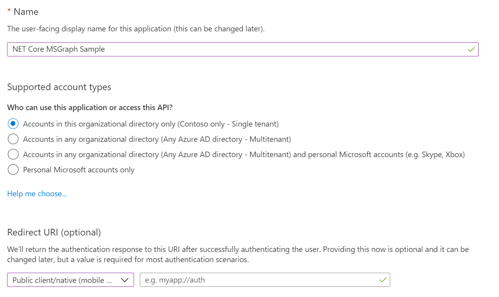
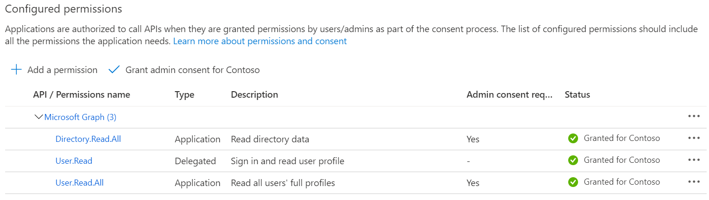

# Advanced Query Capabilities for Directory Objects with .NET SDK

This is a sample .NET Core application using the [Microsoft Graph SDK](https://github.com/microsoftgraph/msgraph-sdk-dotnet) to query AAD.

## Getting Started

### 1. Register your application

Use the [Microsoft Application Registration Portal](https://aka.ms/appregistrations) to register your application with the Microsoft Graph APIs.

**Note:** Make sure to set the right Redirect URI for .NET Core apps: `http://localhost`.

### 2. Set the Permissions

Add the delegated permissions for `User.Read.All` and `Directory.Read.All`.

### 3. Configure the App Secret using the Secret Manager

This application use the [.NET Core Secret Manager](https://docs.microsoft.com/aspnet/core/security/app-secrets?view=aspnetcore-3.1&tabs=windows) to store the ClientId.
To add the ClientId created on step 1:

1. Open the Developer Command Prompt under `dotnet-aad-query-sample\MSGraphSamples.WPF\` directory
2. type `dotnet user-secrets set "clientId" "<YOUR CLIENT ID>"`

## Build & Run

If everything was configured correctly, you should be able to run the application, and see the first login prompt.  
The auth token will be cached for the subsequent runs.

### Using the app

You can query your tenant using the standard OData `$filter`, `$search`, `$orderBy`, `$select` clauses in the relative textboxes.

If you double click on a row, a default drill-down will happen (for example by showing the list of transitive groups a user is part of).  
If you click on a header, the results will be sorted by that column. **Note: not all columns are supported**.  
If any query error happen, it will displayed with a MessageBox.  
The generated URL will appear in the readonly Url textbox. You can Click the graph Explorer button to open the current query in Graph Explorer.
